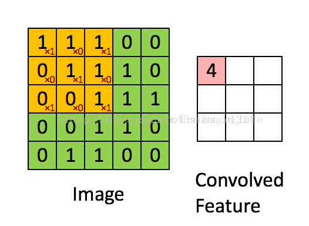
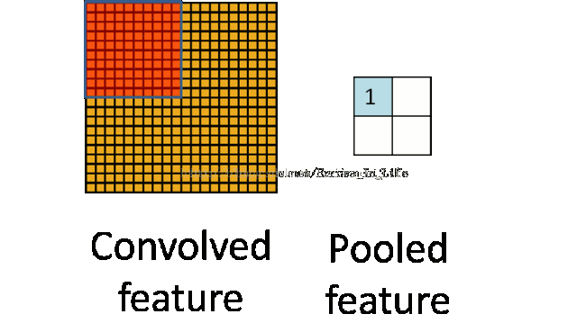
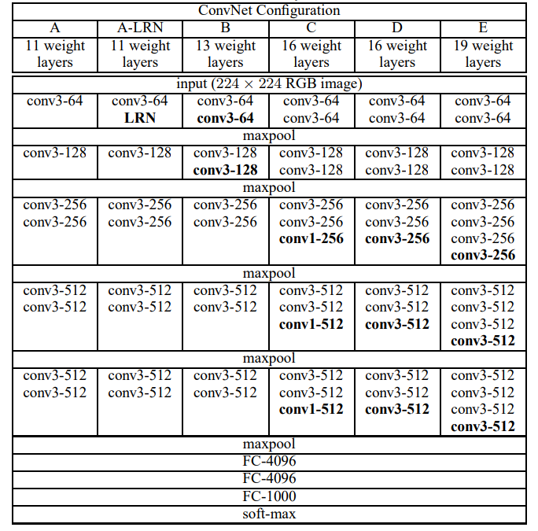

# VGG模型解析

VGG是牛津大学的Karen Simonyan和Andrew Zisserman在挑战2014年的ILSVRC时提出的系列模型。基于模型研究和比赛结果，两人发表了论文[《Very Deep Convolutional Networks For Large-Scale Image Recognition》](https://arxiv.org/abs/1409.1556)。VGG的重要意义在于，其研究结果表明增加深度能够提高卷积神经网络的性能。在VGG16之后，人们沿着更深层的网络这个方向，取得了一系列新的进展。本文结合原作者的论文，解析VGG模型的结构和基本原理。过程中会简单介绍卷积神经网络的一些基本要点。

## 卷积神经网络

卷积和池化是卷及神经网络（以下简称CNN）中的核心。我们使用CNN处理图像时，通过设置卷积核的尺寸和深度，以及池化层的大小，完成图像的特征提取。一般而言，计算机中的图像按照RGB颜色模式存储，本质上是一个$(width, height, channels)$的三维数组，其中channels为3，代表RGB三个颜色通道，每个通道是一个$(width, height)$的二维数组，我们通过一个$n\times n$的参数矩阵，对二维数组进行矩阵点乘（每个元素对应相乘），然后将结果矩阵的值相加，计为输出矩阵中的一个单位值。这个过程如下图所示：

卷积核还有一个参数深度，表示输出多少个新的矩阵，因此，直观的理解，通过卷积操作之后，图像的尺寸下降而深度增加，我们得到的是更为抽象的信息，例如颜色、轮廓等。卷积之后的矩阵中，相邻元素表示的是相似的信息，我们通过池化将所有信息进行合并。池化也是一个类似卷积的过程，我们通过一个矩阵对二维数组进行扫描，只是该矩阵不带参数，扫描的区域的值简单的进行取最大值或者平均值的操作，将相似信息进行提取。池化的过程如下图所示：

## VGG模型基本结构

通过前面的描述，我们知道卷积核的大小是非常重要的，VGG模型的研究表明，较深的层+较小的卷积核，在特征提取上可以取得更好的效果。VGG是一系列模型，有不同的配置，编号从A到E，深度不断增加，如下表所示：

由于VGG最初用于ImageNet数据集的分类任务，所以输入图片统一尺寸为(224, 224)。整个网络中都用了3x3大小的卷积核，并配合1x1的卷积核进行简单的线型转变（不改变图片大小）。卷积核名字中-之后的数值表示卷积核输出的深度，随着网络深度的增加，卷积核输出深度从64逐步增加到256，而网络深度也从11层增加到19层，这其中包括了最后的3个全连接层。这就是VGG模型的基本结构，非常简单，但取得了非常好的效果，同时也非常易于扩展。

## VGG模型的研究向我们揭示了什么

VGG模型本身非常简单，很容易理解，在VGG模型的实践中，作者通过实验和对比，发现了很多有趣的规律。例如上面提到的"较深的网络+较小的卷积核"可以取得更好的特征提取性能。下面，我们一一介绍作者的发现。

### "深网络+小卷积核"

首先我们了解一下"感受野"的概念。简单的说，感受野就是通过卷积网络之后，输出矩阵的单位对应原矩阵区域的大小。例如，一个5x5的图像，经过3x3的卷积之后，尺寸变为3x3，新的矩阵中一个元素对应原始矩阵中的3x3区域。

作者提到，2个3x3的卷基层和1个5x5的卷基层，感受野(receptive field)是一致的，都是4x 4，但是最终实验的结果却表明，前者的效果要优于后者。作者还对比了3x3卷积层和1个7x7卷积层，得到了相同的对比结果。同时，使用深网络+小卷积核还有一个好处，那就是参数较少。假设一个卷积核的深度为C，那么3个3x3卷积核需要的参数为3^2 * C^2 *  3，即27 * C^2（C^2表示C的平方），而1个7x7的卷积核的参数个数为7^2 * C^2，即49 * C^2，后者多出了81%的参数。

### pretrain与fine tune

作者在训练模型时，基本延续了2012年ILSVRC冠军模型AlexNet的训练参数配置，包括对AlexNet的LRN进行了对比（最后发现加入LRN并不会对模型有明显的提升）。最终的训练结果显式，学习率下降了3倍，而且在370K个迭代（74 epochs）就结束了训练。作者认为有2个原因：1，"深度网络+小卷积核"隐含的实现了数据的正态化；2，作者使用了预训练与微调的训练方式。

前面我们提到，VGG系列模型从A到E，深度不断增加。作者在训练时，先使用随机初始化对模型A进行训练，然后将训练得到的权重来初始化模型B，模型B只比A多了两层卷积，这两层卷积依然采用随机初始化。这样，有效的降低了模型B的训练时间。不过，作者在提交比赛结果之后发现，使用论文[《Understanding the difficulty of training deep feedforward neural networks》](http://proceedings.mlr.press/v9/glorot10a/glorot10a.pdf)的方法，也可以直接使用随机初始化进行训练，不需要预训练参数。

### 图像多尺寸缩放

作者在训练模型时，对图像的尺寸进行了调整。ImageNet比赛中的图片尺寸都是224x224，因此，作者将输入图片进行了缩放，设缩放后的图片最小边长为S，然后使用224x224的尺寸对图片进行裁剪，缩放时保证S>=224。当：

- S=224时，裁剪时可以覆盖全部图片

- S>>224时，即S远大于224，这时裁剪的结果只能覆盖部分图片，覆盖的范围是图片中的一个物体或物体的一部分。

那么，如何缩放图片呢？作者提出了两种方法，一种是S取固定值，先将S固定为256（参考了AlexNet的训练参数）进行训练，然后再基于训练结果将S设置为384，继续训练。第二种方法则是多缩放值训练，在一个范围[S_min, S_max]内随机取值并赋给S（实践中取S_min=256, S_max=512），然后进行训练。因为现实中输入图片的尺寸可能各不相同，这种训练方式可以获得更好的泛化性。同时，作者仍然使用了预训练的思想，以S=384的固定值训练为基础，进行多缩放值的训练。

在验证阶段，作者也提出了图片缩放的思想。假设验证时，图片缩放后的最小值为Q，也使用了2种取值方法。第一种为Q取固定值，针对S不同的取值情况：

- S取固定值时，Q=S
- S在[S_min, S_max]范围时，Q=0.5(S_min + S_max)

第二种为Q取多种值：

- S取固定值时，Q 从 集合{S-32, S, S+32}中取值

- S在[S_min, S_max]范围时，Q从集合{ S_min, 0.5(S_min+S_max), S_max }中取值

在训练和验证阶段，作者发现对图片进行多值缩放，都可以取得更好的效果。

## 后记

以上对VGG模型进行了简单的介绍。人工智能领域的发展是非常迅猛的，作为一个2014年提出的经典模型，VGG虽然被后来的模型超越，但是它给我们带来了很多重要的启示。如**卷积网络深度增加可以获得更好的效果**，沿着这个方向，人们发现简单的堆叠层并不能获得更好的精度，反而出现了精度的下降，继而诞生了ResNet，将训练深度增加到最多152层；**预训练权重对后续模型的初始化**，在一定程度上解决了增加深度后，梯度无法收敛的问题；以及**图像多值缩放取得更好的泛化效果**，指出对数据进行补益可以提高模型效果。在后面的系列文章中，我们还会沿着VGG支出的方向，以及它带给我们的启示，介绍更多的模型和视觉领域的新成果。
