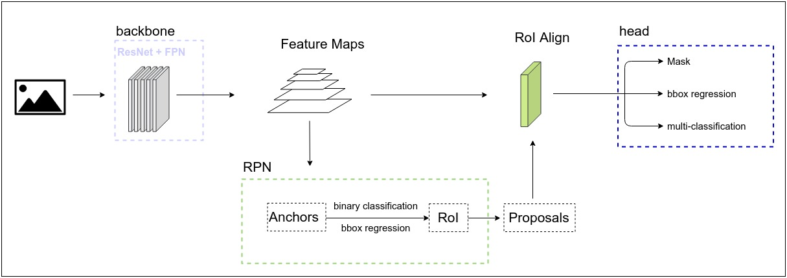
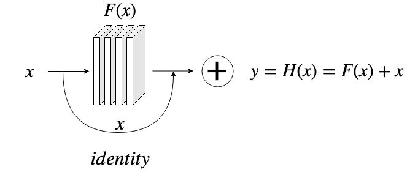
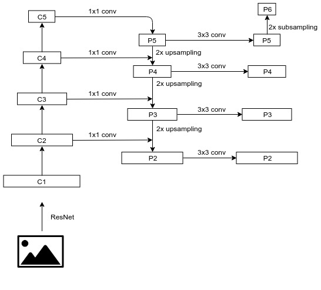
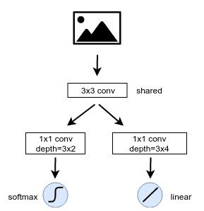
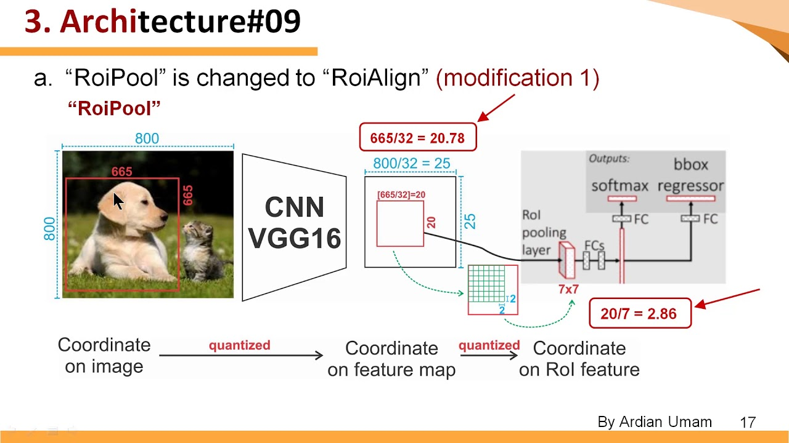
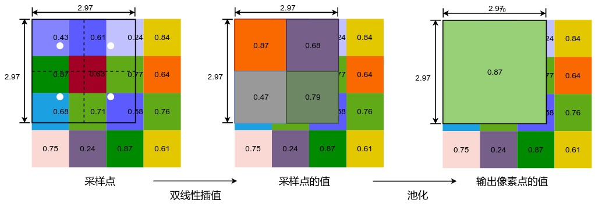

# Mask R-CNN模型简介

Mask R-CNN是由华人学者何凯明教授主导的一个多任务深度学习模型，能够在一个模型中完成图片中实例的分类和定位，并绘制出像素级的遮罩(Mask)来完成分割任务。Mask R-CNN是一个较为复杂的模型，使用了若干不同的网络模型，包括ResNet，FPN，RPN以及分类和回归模型。下面，我们对Mask R-CNN进行逐步的剖析。

## Mask R-CNN的三个主要网络

Mask R-CNN包括三个主要的子网络：

- backbone网络
- RPN网络
- head网络

整体结构如下图所示：

下面，我们逐步分析这三个主要的网络。

### backbone网络

Mask R-CNN的backbone网络，也称为骨干网，主要用于图像的特征提取。在Mask R-CNN之前，Faster R-CNN使用一个共享的卷积神经网络作为骨干网，Mask-RCNN的一个改进点在于，使用ResNet+FPN作为backbone网络，对于输入图片，生成多种尺寸的特征图，形成不同level的特征图金字塔，进一步强化了backbone网络的特征提取能力。

### ResNet网络

我们在图像分类的任务中介绍过了VGG网络，在2014年，VGG的作者通过实验发现，增加卷及神经网络的深度可以提高模型精度，当时人们认为十几层的网络已经是非常深的网络了，VGG的作者推断，在VGG的基础上继续增加网络深度，模型的精度还可以继续提高。然而，人们通过实验发现，简单的叠加卷积层，会导致梯度弥散和梯度爆炸现象，通过合理的初始化和对中间层的正则化，使得我们可以训练深度达到几十层的网络。然而，随着深度的进一步增加，模型又出现了退化现象，即深度增加反而导致模型精度下降，这说明，深层神经网络不能通过简单的 增加深度进行优化。

当时还在微软研究院的何凯明教授和他的同事们通过对深层网络的研究，提出了ResNet模型。既然简单粗暴的叠加神经层会导致精度下降，那么，通过加入一个残差模块，通过模型的训练，在适当的情况下让深度网络退化成一个浅层的网络，这样就能避免过深的网络带来的退化问题。通过在正常的深层网络中加入一个恒等映射，就可以实现残差模块，如图下所示：

ResNet提出后，网络训练的深度从VGG时代的十几层，一举跃升至ResNet Xt的152层，ResNet也在VGG之后的2015年夺得ILSVRC图像识别的冠军，top5的错误率降低到5.37%，首次在ILSVRC竞赛中超过了人眼的识别精度5.1%。

### FPN

Mask R-CNN的backbone网络还包括了FPN(Feature Pyramid Network，图像特征金字塔)。FPN是Facebook的AI实验室FAIR在2017年提出的。2017年，何凯明教授已经从微软离开，加入FAIR，也参与了FPN的研究和论文发表，从ResNet到FPN再到Mask R-CNN，都有何教授的参与或主导，不得不令人佩服。直观的理解，图像在卷积神经网路的处理过程中，其尺寸逐步减小，而深度逐步增加，随着深度的增加，图像的细节特征逐步退化，而呈现出更抽象的语义特征。常规的卷积神经网络往往采用最后一个卷积的结果对图像进行分类，对于图片中一些较小的物体，则无法达到较好的效果。FPN的思想是，保留卷积过程中不同阶段的输出结果，同时进行训练，这样，既能在较为抽象的特征中识别较大物体，也能够在细节较多的特征中对小物体进行有效的识别，对不同层次的语义特征都能够进行有效的利用。

ResNet在卷积处理的过程中，定义了不同的stage，每个stage输出不同尺寸的特征图，而这种结构恰好可以用来生成FPN，与FPN结合的天衣无缝，这两种模型的组合如下图所示：

通过ResNet与FPN，我们得到了P2到P6这5中规格的特征图，用作后续两个模型的输入，下面是经过backbone处理的P2到P6的一个示例结果：

## RPN网络

RPN网络主要用于生成Proposal，即带有前景、背景、包围框信息的区域。通过backbone网络，我们已经生成了不同尺寸的特征图。在RPN中，我们先对特征图上的每个像素都生成3个Anchor(像素区域的锚框)，Anchor的长宽比为1:2, 1:1, 2:-1，即[0.5, 1, 2]。假设输入图片我们统一处理成1024x1024，则P2到P6特征图的边长分别为[256, 128, 64, 32, 16]，特征图单个像素对应原图区域的边长则分别为[4, 8, 16, 32, 64]，以P2为例，我们对每个像素生成的3个anchor尺寸为：

| 比例 | 长          | 宽          |
| ---- | ----------- | ----------- |
| 0.5  | 4 / (2^0.5) | 4 * (2^0.5) |
| 1    | 4           | 4           |
| 2    | 4 * (2^0.5) | 4 / (2^0.5) |

需要注意的是，为了保证anchor面积不变，长宽的大小在变化时，要乘以或者除以根号2（表中用2^0.5表示）。对于P2，我们要生成anchor数量为256x256x3，P3的数量为128x128x3，以此类推。生成的全部anchor数量为3x(256^2+128^2+64^2+32^2+16^2)=261888。

### Anchor的训练

Anchor生成之后，我们需要对Anchor进行处理，生成可以训练的数据，包括两个部分：

- Anchor是前景还是背景
- Anchor的包围框修正信息

我们通过IoU(Intersection over Union)来判断一个Anchor是前景还是背景。我们对比一个Anchor和Ground Truth的包围框，计算两个框的交集与并集的商，即两个框重合的比例有多大，IoU如下图的示意：

显然IoU的范围为[0, 1]，当Anchor与Ground Truth box完全不相交时，IoU为0，当两者完全重合时，IoU为1，IoU越大，表示Anchor框住的物体面积越大。我们把IoU大于0.7的Anchor标记为前景（正样本），小于0.3的Anchor标记为背景（负样本），而IoU在0.3和0.7之间的Anchor认为是不明确的Anchor，我们在训练时丢弃不用。

通过IoU我们标记出Anchor的正负样本，针对正样本，我们需要对其进行包围框的回归。假设Ground Truth box的中心点和宽高分别为x, y, w, h，Anchor的中心点和宽高分别为x', y', w', h'，然后，我们计算下面4个量：

- dx = (x-x') / w'
- dy = (y-y') / h'
- dw = log((w-w') / w')
- dh = log((h-h') / h')

然后对这4个量进行回归训练，得到Anchor的修正信息。

在训练阶段，我们将输入的特征图进行一个3x3的卷积，得到F，对F进行一个（1x1，6）的卷积（代表卷积核大小为1x1，深度为6，即Anchor数量3乘以二分类数量2），再输入到一个softmax层得到二分类；对于包围框回归，则是对F进行一个(1x1, 12)的卷积，12即Anchor数量3乘以修正信息的个数4，再将卷积结果输入到一个线性回归层。这个过程如下图所示：

其中分类问题使用交叉熵损失函数训练，回归问题使用SmoothL1损失函数进行训练。这样，通过对Anchor的训练，我们就得到了初步的Anchor分类和回归模型。

### RoI

RoI，即Region of Interest，字面的意思就是"感兴趣区域"，也就是我们认为有可能是框住物体的区域（我们对这样的区域是感兴趣的）。Anchor经过前面的训练，得到了前景背景分数，我们使用softmax做分类，因此，前景背景分数即anchor为前景或背景的概率。我们筛选出前景分数较高的Anchor，然后通过修正信息得到修正后的包围框，再对修正的包围框进行NMS(Non-Max Supression，非极大值抑制)处理，去掉重复的修正狂，最终得到与Ground Truth box最匹配的若干个修正框，即RoI。

得到RoI后，我们生成head网络所需的数据。首先计算RoI与Ground Truth box的IoU并设置阈值0.5，IoU大于0.5的样本标记为正样本，小于0.5的标记为负样本，对于正样本，我们要给出head网络训练所需的三个值：

- 正样本RoI所框住物体的分类id
- 正样本RoI与Ground Truth box的偏移量（RoI是Anchor训练得到的，与Ground Truth box还会存在偏移差）
- 正样本RoI的Mask信息

RoI可能与多个Ground Truth的IoU大于0.5，我们取IoU最大的Ground Truth，将其分类id和Mask信息赋给RoI；RoI边框修正信息的计算方式与Anchor一致。这样，RoI的正样本中，就包含了某个具体物体的分类、Mask信息和边框修正信息，我们将带有这些信息的RoI称为Proposal，将其输入到RoI Align层后，再进入head网络进行进一步的训练。

## RoI Align

RoI Align是Mask R-CNN针对Faster R-CNN的一个重要改进。在Faster R-CNN模型中，需要将Proposal和特征图池化为固定的尺寸，以便于后续head网络的训练。Faster R-CNN中的backbone网络使用的是VGG16，生成的特征图stride为32，即尺寸为原图的1/32，因此原图的包围框向特征图映射时，除以32，会出现浮点数，Faster R-CNN中对浮点数直接进行了取整的操作，这一步损失了一部分精度。在RoI Pooling层中，要对包围框进一步进行池化操作，将大小固定为7x7，缩放后又会出现浮点数，RoI Pooling层会对浮点数再进行一次取整操作，因此又损失一部分精度。以下图为例，原图大小为800x800，物体大小为665x665，第一次映射后，边长变为655/32=20.78，取整后为20，原图映射为20x20的特征图。第二次映射后后，20x20的特征图被固定为7x7尺寸，20/7=2.86，则源特征图中的2个像素映射为1个像素，将7x7的特征图进行上采样映射会源特征图，发现对应的面积仅为14x14，误差非常大。这会导致head网络中的回归产生较大的偏差。

Mask R-CNN的RoI Align层做法有所不同。作为对比，我们假设仍然使用VGG作为backbone网络，则原图向特征图映射时，655x655的物体特征图尺寸为20.78x20.78，这一步并不进行取整操作，而是保留浮点数。经过RoI Align池化为7x7的区域时，首先将20.78x20.78的区域分为7x7网格，则每个网格单元大小为20.78/7=2.97，也即池化后单位像素在特征图中对应的长度。接下来设置一个采样点的数量，一般为4，即把特征图中2.97x2.97的区域平均划分为2x2，共4个更小的区域，每个区域按照双线性差值算法计算中心点的像素值作为该区域的值，将得到的2x2采样区域的4个采样点的值计算出来，再进行一次池化，这样，最终也能生成7x7的区域，但是并没有丢失精度。RoI Align采样点的计算过程如下图所示：

除了精度操作，由于Mask R-CNN使用ResNet+FPN作为backbone网络，输出的特征图尺寸有所不同，在原图向特征图进行映射时，需要先计算出特征图在FPN中的level，按照公式`level=[k0 + log2(sqrt(w*h) / 244)]`，其中k0是w,h=244,244时对应的level，一般取4，得到FPN的level后，得到特征图对于原图的缩放比例，就可以进行映射了。

由于Mask R-CNN中在head网络增加了mask分之，因此RoI Align除了将包围框固定为7x7，还会将mask则固定为14x14，计算的方式与上述过程是一致的。

## Head网络

经过RoI Align的池化操作，就得到了head网络的训练数据。即：7x7的包围框，14x14的mask信息以及分类信息。

### 分类与回归分支

head的输入数据首先经过两层卷积网络，然后输入到两个全连接层，在分别输入到softmax和线性回归激活层。其中softmax层使用交叉熵损失函数训练，线性回归使用SmoothL1损失函数训练。这与RPN中Anchor的训练是一致的。

### Mask分支

RoI Align池化固定的14x14 mask信息经过几层conv， BatchNorm， ReLU后，再进行2x2的反卷积操作，得到28x28的图像区域。然后经过大小1x1、深度为分类个数的卷积操作，输出每一个分类的28x28 mask信息，再经过一个sigmoid激活函数，这样28x28的像素区域，每个区域的值为0或1，代表是否为物体的遮罩。mask分支采用二元交叉熵损失函数进行训练，来预测每个像素位置为0还是1。

至此，我们浏览了整个Mask R-CNN模型的结构，Mask R-CNN模型的损失函数一共有5个：

- Anchor二分类，交叉熵损失函数
- Anchor包围框回归，SmoothL1损失函数
- head网络的分类，交叉熵损失函数
- head网络的回归分支，SmoothL1损失函数
- head网络的mask分支，二元交叉熵损失函数